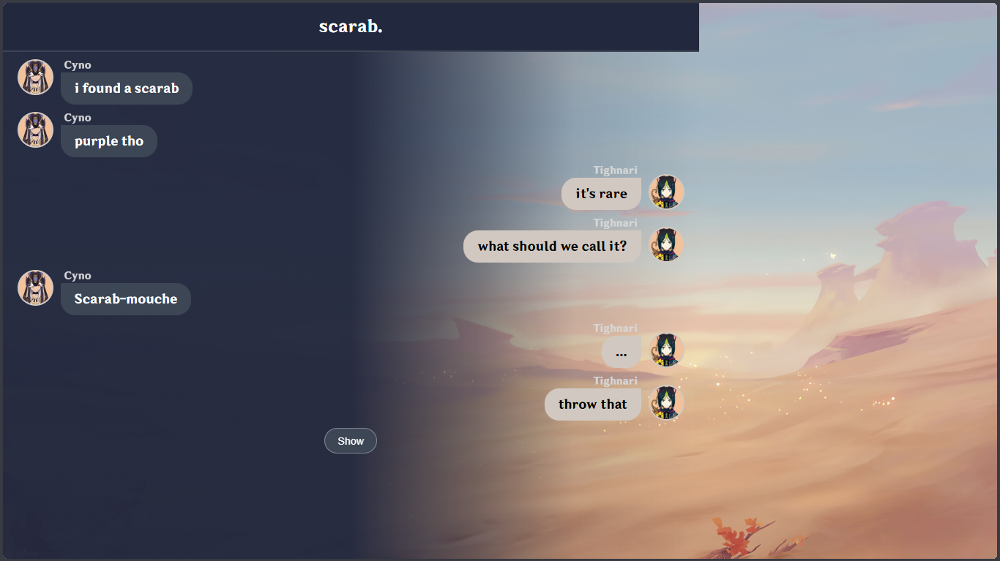
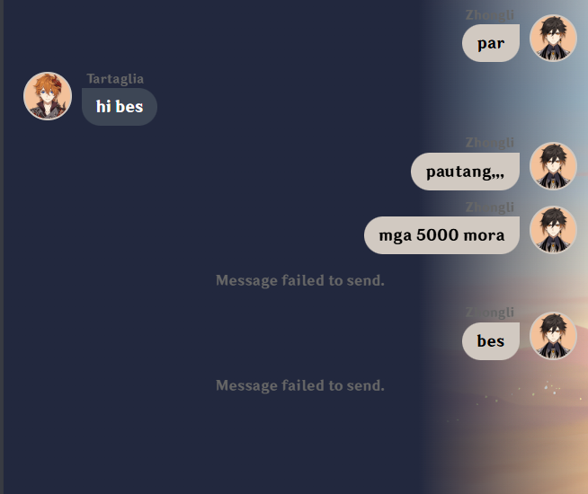
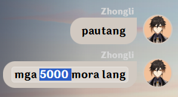
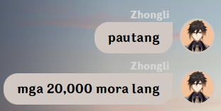
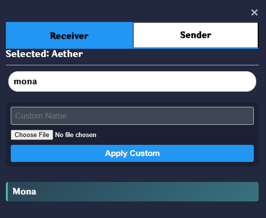
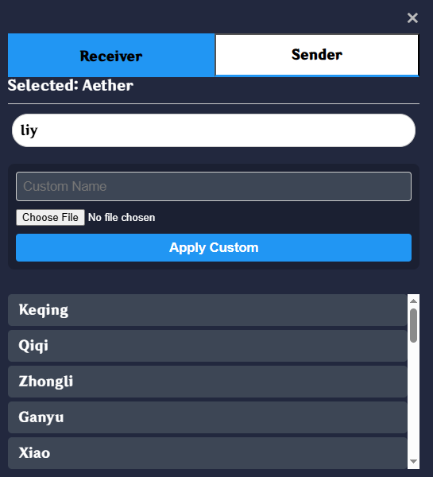
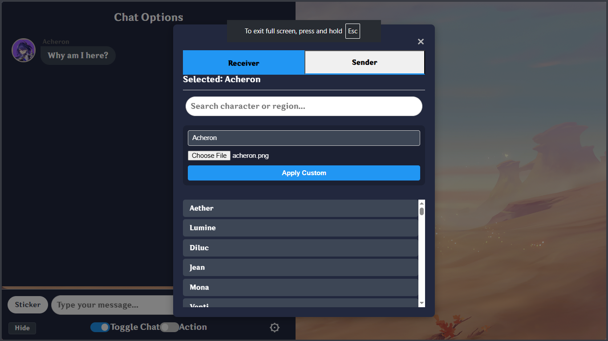
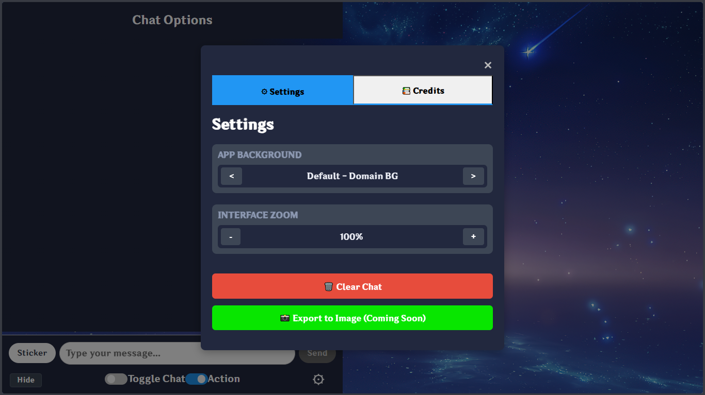
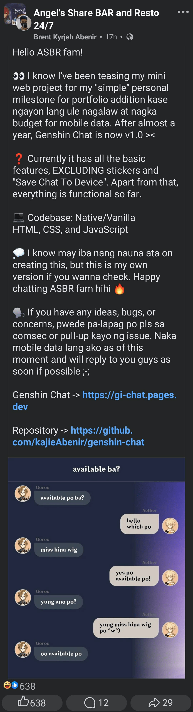

# Genshin Chat

Make your next banger post here with **Genshin Chat**!

Create meme-worthy conversations between your favorite characters using the Genshin Impact chat interface we all are familiar with. Perfect for roleplays, interactions, fake drama, or forcing another Cyno joke onto Tighnari. *(pls let him rest already ;-;)*

## 🌐 Live App

Access the app here at [gi-chat.pages.dev](https://gi-chat.pages.dev)

### Version & Changes

This is version **v1.1.0**.

*Please see the [changelog here](release-notes/v1-1-0_release-notes.md) on what was changed since last version.*

## ⚠ Disclaimer

Genshin Chat is a fan-made project and is not affiliated with or endorsed by HoYoverse.

Genshin Impact and all related trademarks, assets, and characters belong to their respective owners.

Notice of usage of fanmade icons can be [found here](release-notes/other/file-use-acknowledgement.md)

## 📸 Screenshots

### Main Interface

### Action Message

### Edit Message
Directly edit in the bubble by simply tapping the message.

### Character Search Feature
Character-specific search

Region-specific search (first letters of the region already works)

### Custom Character

### Settings

## ⚙ Features

### Character Selection

- Pick a sender and receiver from the **playable roster** of Genshin Impact characters
- Search characters by <u>name</u> or <u>region</u> — even typing the first few letters of a region works
- Custom sender/receiver support if you want to bring in someone who isn't on the list *(yes, even Acheron)*
  - Character icon upload support **up to 2MB**
- Character selector shows a region-themed background to indicate nationality.

### Message Types

Three message types to cover every situation:

- `Message` — your standard chat bubble, left or right
- `Action` — for roleplay-style system messages *(e.g. "Xiao has left the group", "Ei burned her kitchen")*
- `Time` — timestamp-style dividers *(e.g. "- 6:07 AM -")* to split your conversations into chapters

### Image Messages

- Upload an image directly into the chat as a message
- Supports image messages **up to 5MB**
- Renders inside the chat thread

### Chat Editing

If you have an "oopsie" moment while editing, no worries. You have full control.

- **Edit** — tap any bubble to edit it inline, right there
- **Move** — reorder messages up or down the thread
- **Switch** — flip who sent the message between sender and receiver
- **Change Character** — reassign which character is tied to that specific message
- **Delete** — remove messages you don't want anymore

### Background & Appearance

- **9 preset Genshin-style backgrounds** to set the scene:
  - Domain, Mondstadt, Liyue, Inazuma, Sumeru, Sumeru Desert, Fontaine, Natlan, Nod-Krai
- Upload a **custom background image** of your own (up to 2MB)
- Adjust **UI text zoom** from 70% to 150% — readable on any screen
- All appearance settings persist between sessions

### Export to Image

- Export the full chat as a screenshot-style **PNG** — title, background, and all
- Uses *html2canvas* under the hood for a clean, full-fidelity capture
- Ready to post, share, or save in your gallery

### Saving & Sessions

- Chats are **automatically saved** to your local browser to pick up where you left off
- **Name and manually save** multiple chats to switch between them anytime if you want to load them anytime
- **Load and delete** saved chats from the settings panel
- A **tutorial/example chat** loads automatically on first visit so you know what you're doing

## How To Use

1. Choose a sender and receiver from the character list.
2. Type your chat title if you want one *(tap the title text to edit it)*.
3. Pick a message type:
   - `Message`
   - `Action`
   - `Time`
4. Type your text, or drop in an image when you're feeling extra.
5. Press `Send` or hit `Enter`.
6. Edit the message thread to fix wording, swap positions, switch senders, or just fix your own crimes.
7. Export the final chat to image when you're done.

All your conversations are automatically saved to your browser, so you can pick up where you left off anytime.

## 💻 Tech Stack

Built entirely using:
- **HTML5** - Clean, semantic web standards
- **CSS3** - Modern styling with theme variables
- **Vanilla JavaScript** - No BS, just JS
- **LocalStorage API** - For persistent conversation storage
- **html2canvas** - For seamless chat exporting experience

This means Genshin Chat is designed to be lightweight and faster than Genshin's loading screen!

## ✨ Why You'll Love It

- **Massive Character Roster**: Up-to-date roster of Genshin Impact *playable* characters. (I have to emphasize that part).
- **Chat Customization**: Perfect if you want to make Acheron lost to Teyvat...
- **Familiar Wondrous Aesthetics**
  - The chat UI closely resembles the in-game interface.
  - When selecting a character, its background will display the region's resemblance.
- **Easy to Share**: Just press "Export to Image", and you're ready to share the next banger joke.
- **Automatic Saving**: Your conversations are saved between sessions, so they're never lost.
- **Action Messages**: Create special roleplay moments like *"Xiao left the group"* or *"Ei burned her kitchen"*
- **Instant Fun**: No sign-ups, no ads. This is a pure passion project for fun and for the community.

## 🌐 Compatibility

Works on all modern browsers, including phones and tablets. Straightforward as your gacha win streak 😬

## 📝 Notes

- **Privacy First**: All conversations are stored locally in your browser. There's no data sent to servers. There's no server-side code to begin with.
- **Always Available**: Your chats persist between sessions, so your masterpiece conversations are never lost.
- **Lightweight**: Built with pure vanilla code for a fast, responsive experience.

### 🌧 On character selections...

*For fair use statement regarding with fan-art icons, please refer to [this section](#-disclaimer).*

The following character/s is/are available, but we don't have the icons yet *until the character/s is/are officially released*. This list is tentative and I will also keep watch of it. ~Pls remind me as well by pulling up an Issue lol~

- **Sandrone** - July 1, 2026
- **Pulcinella** - version 7.X
- **Pantalone** - version 7.X
- **Pierro** - version 7.X
- **Tsaritsa/Snezhnaya** - version 7.X
- **Alyosha** - version 7.X
- **Noy** - version 7.X
- **Mitya** - version 7.X
- **Vesna** - version 7.X
- **Danica** - version 7.X
- **Odette** - version 7.X
- **Valeriy** - version 7.X
- **Alice** - version 7.X

### 🤔 Future Considerations?

- **Stickers**: Curated sticker packs are in testing right now. More chaos will arrive later.

## 📄 License

This project is licensed under the MIT License.
Please see the `LICENSE` file for details.

## 💭 Contribution

Found a bug or have a suggestion?

Feel free to open an issue or submit a pull request.
Feedback and suggestions are always welcome!

## 📢 Promotions

I am also promoting via the Facebook group **"Angel's Share Bar and Resto"**!

---

**Have fun creating fake Genshin Impact conversations!** 😄
